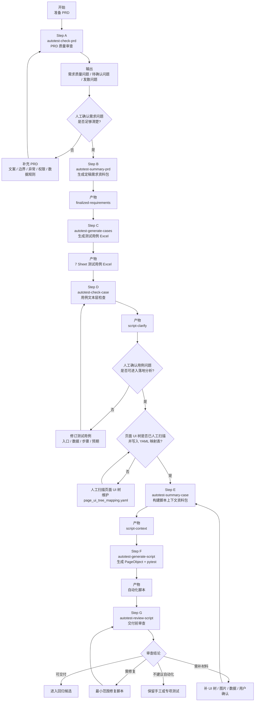
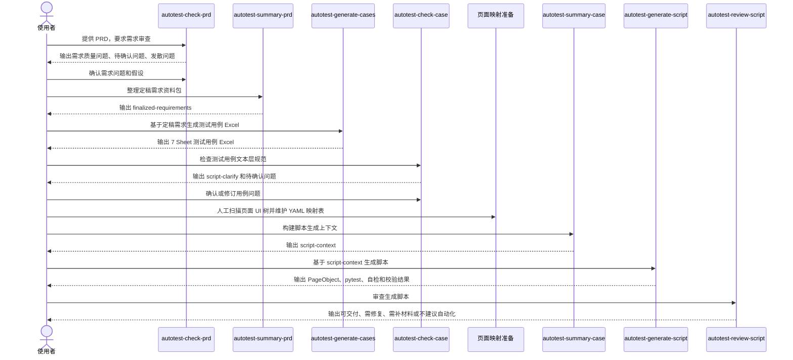

# PRD 到自动化脚本全链路工作流使用说明

本文档用于说明如何通过一组标准化 Skill，把产品需求文档逐步转化为可审查、可运行、可维护的 Airtest + Poco + pytest 自动化脚本。

完整链路分为两个阶段：

| 阶段 | 目标 | 产物 |
| --- | --- | --- |
| PRD 转测试用例 | 把需求问清楚，生成结构化测试用例 Excel | 定稿需求资料包、测试用例 Excel |
| 测试用例转自动化脚本 | 检查用例文本，分析工程落地条件，生成并审查脚本 | 脚本上下文资料包、PageObject、pytest 用例、审查报告 |

核心原则：

- AI 不替产品决定需求。
- AI 不跳过人工确认。
- AI 不跳过测试用例文本检查。
- AI 不跳过页面 UI 树扫描和 YAML 映射表。
- AI 不凭一句话直接写脚本。
- pytest 层只做流程编排，业务动作和断言必须下沉到 PageObject。
- 生成脚本后必须独立审查，再进入回归候选。

## 一、适用范围

适用于以下场景：

| 场景 | 是否适用 | 说明 |
| --- | --- | --- |
| PRD 质量审查 | 适用 | 找出矛盾、含糊、缺失、不可测、歧义、超范围等问题 |
| PRD 转测试用例 Excel | 适用 | 输出 7 个 Sheet 的结构化测试用例 |
| 测试用例自动化候选检查 | 适用 | 只从用例文本判断是否具备进入落地分析的条件 |
| 自动化脚本上下文构建 | 适用 | 结合页面映射、UI 树、截图、PageObject、pytest、图片资产和工程规则 |
| Airtest + Poco + pytest 脚本生成 | 适用 | 生成 PageObject 文件和 pytest 用例文件 |
| 交付前脚本审查 | 适用 | 检查用例一致性、分层、locator、图片兜底、断言有效性 |
| 无 PRD、无测试用例的纯口述脚本生成 | 不适用 | 需要先补 PRD 或测试用例输入 |

## 二、Skill 总览

| 阶段 | 顺序 | Skill | 职责 | 主要产物 |
| --- | --- | --- | --- | --- |
| PRD 转测试用例 | Step A | `autotest-check-prd` | 审查 PRD 质量，输出待确认问题和发散问题 | 需求质量问题、待确认问题、需求发散问题 |
| PRD 转测试用例 | Step B | `autotest-summary-prd` | 整理原始需求、评审结果和人工确认 | `testcase-workflow/finalized-requirements/` |
| PRD 转测试用例 | Step C | `autotest-generate-cases` | 基于定稿需求资料包生成测试用例 Excel | 7 个 Sheet 的测试用例 Excel |
| 测试用例转脚本 | Step D | `autotest-check-case` | 只检查测试用例文本规范和文本层自动化候选性 | `testcase-workflow/script-clarify/` |
| 测试用例转脚本 | Step E | `autotest-summary-case` | 做工程落地分析，构建脚本生成上下文 | `testcase-workflow/script-context/` |
| 测试用例转脚本 | Step F | `autotest-generate-script` | 基于上下文资料包生成 PageObject 和 pytest | PageObject 代码、pytest 用例 |
| 测试用例转脚本 | Step G | `autotest-review-script` | 审查脚本或失败归因 | 审查结论、问题清单、可交付判断 |

参考文件说明：

| Skill | 主要参考文件 |
| --- | --- |
| `autotest-check-prd` | `references/autotest-check-prd-reference.md` |
| `autotest-summary-prd` | 规则集中在 `SKILL.md` |
| `autotest-generate-cases` | `references/autotest-generate-cases-reference.md` |
| `autotest-check-case` | 规则集中在 `SKILL.md` |
| `autotest-summary-case` | 规则集中在 `SKILL.md` |
| `autotest-generate-script` | `references/autotest-generate-script-reference.md` |
| `autotest-review-script` | 规则集中在 `SKILL.md` |

## 三、全链路流程图



## 四、关键产物目录

| 目录或文件 | 生成阶段 | 说明 |
| --- | --- | --- |
| `testcase-workflow/finalized-requirements/` | `autotest-summary-prd` | 定稿需求资料包 |
| `testcase-workflow/finalized-requirements/.managed-by-autotest-summary-prd` | `autotest-summary-prd` | 受管目录标记文件 |
| 测试用例 Excel | `autotest-generate-cases` | 7 个 Sheet 的结构化测试用例 |
| `testcase-workflow/script-clarify/` | `autotest-check-case` | 测试用例文本层检查结果 |
| `testcase-workflow/script-clarify/.managed-by-autotest-check-case` | `autotest-check-case` | 受管目录标记文件 |
| `tools/pages/page_ui_tree_mapping.yaml` | 人工准备 | 页面名称与 UI 树、截图、prompt 等页面物料的映射表 |
| `testcase-workflow/script-context/` | `autotest-summary-case` | 自动化脚本生成上下文资料包 |
| `testcase-workflow/script-context/.managed-by-autotest-summary-case` | `autotest-summary-case` | 受管目录标记文件 |
| PageObject 文件 | `autotest-generate-script` | 页面对象层，承载业务动作和断言 |
| pytest 文件 | `autotest-generate-script` | 测试用例层，只编排流程 |
| `testcase-workflow/script-review/review-report.md` | `autotest-review-script` | 用户要求保存审查报告时写入 |

受管目录清理规则：

| 情况 | 处理方式 |
| --- | --- |
| 目录不存在 | 直接创建 |
| 目录存在且有对应 `.managed-by-*` 标记文件 | 可以清空并重新生成 |
| 目录存在但没有对应标记文件 | 不要清空，先向用户说明并等待确认 |

## 五、阶段一：PRD 转测试用例

### Step A：PRD 质量审查

使用 Skill：

```text
autotest-check-prd
```

Claude Code 用法：

```text
/autotest-check-prd /path/to/prd.pdf
```

职责：

| 做什么 | 不做什么 |
| --- | --- |
| 读取 PRD 或提取后的需求文本 | 不生成测试用例 |
| 检查矛盾、含糊、缺失、不可测、歧义、超范围 | 不替产品决定需求 |
| 做需求发散检查 | 不把发散问题当成已确认需求 |
| 输出需求质量问题、待确认问题和发散问题 | 不污染定稿需求 |

输出清单：

| 清单 | 用途 |
| --- | --- |
| 需求质量问题 | 找出 PRD 本身的矛盾、缺失、不可测等问题 |
| 待确认问题 | 交给产品、测试、研发确认或授权假设 |
| 需求发散问题 | 提醒可能影响测试覆盖的角色、状态、网络、前后台、版本、数据一致性、并发等场景 |

人工确认示例：

```text
针对待确认问题，我确认如下：

Q1：删除标签后只删除标签分组，不删除录音。
Q2：删除弹窗按钮为「取消」和「继续」。
Q3：弱网场景本期作为风险记录，不阻塞用例生成。
Q4：多角色权限本期无差异，统一按普通用户处理。
```

### Step B：定稿需求资料包

使用 Skill：

```text
autotest-summary-prd
```

Claude Code 用法：

```text
/autotest-summary-prd
把原始 PRD、需求评审输出和我的确认回复整理成定稿需求资料包。
```

固定输出：

```text
testcase-workflow/finalized-requirements/
```

资料包文件：

| 文件 | 职责 |
| --- | --- |
| `original-requirement.md` | 原始需求或提取后的需求文本 |
| `requirement-review.md` | PRD 审查阶段的问题清单 |
| `user-confirmations.md` | 用户确认、补充和假设授权 |
| `finalized-requirement.md` | 生成测试用例的主要需求来源 |
| `handoff-summary.md` | 交接摘要、假设、风险和待确认项 |

注意：

- 不重新做需求质量审查。
- 不生成测试用例。
- 不替用户新增确认结论。
- 发散问题只有被用户确认后，才能写入定稿需求。

### Step C：生成测试用例 Excel

使用 Skill：

```text
autotest-generate-cases
```

Claude Code 用法：

```text
/autotest-generate-cases
基于 testcase-workflow/finalized-requirements/ 生成测试用例 Excel。
```

输入优先级：

1. 如果存在 `testcase-workflow/finalized-requirements/`，且用户要求基于定稿需求生成用例，必须优先读取资料包。
2. 如果没有定稿资料包，才读取用户显式提供的 PRD 文件或需求文本。

定稿资料包读取顺序：

1. `finalized-requirement.md`
2. `handoff-summary.md`
3. `user-confirmations.md`
4. `requirement-review.md`
5. `original-requirement.md`

三条绝对铁律：

| 铁律 | 要求 |
| --- | --- |
| 入口路径必须完整 | 每条用例从起始页面写到当前操作页面，App 端从冷启动首页开始 |
| 一条用例只验证一个验证点 | 不同操作分支、不同前置状态、状态矩阵每行必须拆开 |
| 禁止擅自简化 | 步骤、入口路径、预期结果必须完整，输出过长时让用户决定分批 |

Excel 输出结构：

| Sheet | 用途 |
| --- | --- |
| 说明 | 项目信息、来源、风险等 |
| 公共前置条件 | 公共账号、数据、设备、环境等 |
| 页面路径约定 | 页面名称和标准入口路径 |
| 需求质量问题 | PRD 阶段问题追踪 |
| 需求覆盖矩阵 | 功能点与用例覆盖关系 |
| 待确认问题 | 仍待确认或风险问题 |
| 测试用例 | 具体测试用例 |

覆盖类型至少关注：

| 类型 | 说明 |
| --- | --- |
| 正向流程 | 用户按主路径完成操作 |
| UI 展示验证 | 页面元素、文案、格式、排序、图标样式等 |
| 权限场景 | 有权限、无权限、越权、不同角色 |
| 状态组合 | 状态矩阵逐行展开 |
| 输入边界 | 空值、最小值、最大值、超长、非法字符、前后空格 |
| 异常流程 | 取消、返回、关闭弹窗、失败重试等 |
| 网络状态 | 无网络、弱网、网络恢复、请求超时等 |
| 前后台和进程状态 | 切后台、锁屏、杀进程、Web 刷新或会话超时 |
| 版本兼容 | 新旧客户端、新旧服务端、不同平台或依赖版本 |
| 数据一致性 | 列表与详情、多端、多页面同步 |
| 并发和竞态 | 快速连续点击、多人多端同时操作 |
| 回归 | 验证旧功能未受影响 |

## 六、阶段二前置：页面 UI 树和映射表

在进入 `autotest-summary-case` 之前，必须先完成页面物料准备。

必备前置：

| 前置条件 | 要求 |
| --- | --- |
| 人工扫描页面 UI 树 | 已针对候选自动化用例涉及页面完成 UI 树扫描 |
| 页面名称已确认 | 测试用例中的页面名称和实际页面物料一致 |
| YAML 映射表已写入 | 页面名称与 UI 树、截图、prompt 等物料路径已写入 `tools/pages/page_ui_tree_mapping.yaml` |
| 映射范围可追溯 | 每条候选自动化用例涉及页面都能在映射表中找到记录 |

这个前置条件非常关键：

- `autotest-check-case` 不读取页面映射表。
- `autotest-summary-case` 读取和校验已有映射，但不替用户扫描页面。
- 如果 YAML 映射表缺失，或者候选用例涉及页面没有映射记录，应先补页面扫描和映射，再继续构建脚本上下文。

## 七、阶段二：测试用例转自动化脚本

### Step D：测试用例文本层检查

使用 Skill：

```text
autotest-check-case
```

Claude Code 用法：

```text
/autotest-check-case outputs/testcases/demo.xlsx
```

职责：

| 做什么 | 不做什么 |
| --- | --- |
| 读取用户显式提供的测试用例 Excel 或文本 | 不主动扫描工程目录寻找文件 |
| 检查用例 ID、名称、入口路径、前置、数据、步骤、预期、平台差异 | 不读取页面映射表、UI 树、截图、PageObject、pytest、图片目录 |
| 给出文本层自动化候选初判 | 不判断工程可实现性 |
| 输出问题清单并等待用户确认 | 不生成脚本，不构建上下文资料包 |

固定输出：

```text
testcase-workflow/script-clarify/
```

输出文件：

| 文件 | 职责 |
| --- | --- |
| `input-inventory.md` | 本次读取的用例输入、来源、范围和缺失项 |
| `automation-readiness.md` | 每条用例的文本层自动化候选初判 |
| `clarify-issues.md` | 统一问题清单、待确认项、假设授权请求 |

文本层候选初判：

| 结论 | 含义 |
| --- | --- |
| 可进入自动化落地分析 | 文本清晰，入口、前置、步骤、预期、数据足够明确 |
| 需修订/确认后进入 | 文案、规则、步骤、数据、平台、角色等存在含糊点 |
| 建议保留手工或专项测试 | 不适合 UI 自动化或数据准备成本高且收益低 |
| 信息不足，无法判断 | 缺少核心字段 |

人工确认示例：

```text
针对 clarify-issues.md，我确认如下：

P1：入口路径补充为 首页 -> 听蓝 Tab -> 标签管理。
P2：测试数据使用专用标签「自动化标签_001」，执行后删除。
P3：视觉尺寸用例保留手工，不进入自动化。
P4：按假设「iOS 和 Android 路径一致」继续。
```

### Step E：构建脚本生成上下文

使用 Skill：

```text
autotest-summary-case
```

Claude Code 用法：

```text
/autotest-summary-case
基于 script-clarify、用户确认、tools/pages/page_ui_tree_mapping.yaml、页面物料和工程上下文，构建脚本生成上下文资料包。
```

执行前置：

```text
必须先人工扫描候选用例涉及页面的 UI 树，并维护 tools/pages/page_ui_tree_mapping.yaml。
```

职责：

| 做什么 | 不做什么 |
| --- | --- |
| 读取 `script-clarify/` 和用户确认 | 不重新做用例文本规范审查 |
| 读取页面映射表、UI 树、截图、PageObject、pytest、正式图片目录和工程规则 | 不全量塞入无关代码或图片清单 |
| 完成自动化落地可行性分析 | 不生成脚本代码 |
| 输出脚本生成上下文资料包 | 不替用户新增确认结论 |

固定输出：

```text
testcase-workflow/script-context/
```

资料包文件：

| 文件 | 职责 |
| --- | --- |
| `handoff-summary.md` | 交接入口，记录范围、确认数量、风险、缺图摘要和下游读取顺序 |
| `project-structure.md` | 项目关键路径和工程约定 |
| `automation-scope.md` | 可立即自动化和未进入立即自动化的用例清单 |
| `element-mapping.md` | 立即自动化用例的页面元素映射 |
| `image-review-list.md` | 图片人工确认清单和图片状态 |
| `implementation-plan.md` | PageObject 方法设计、断言覆盖表和 pytest 编排计划 |
| `user-confirmations.md` | 用户确认、补充、假设授权及影响 |

自动化可行性结论：

| 结论 | 后续动作 |
| --- | --- |
| 立即自动化 | 进入元素映射和实现计划 |
| 补充材料后自动化 | 写入待补充清单，不默认生成脚本 |
| 暂不自动化 | 不进入脚本生成，保留手工 |
| 需要研发支持 | 提出可测性诉求 |

关键门禁：

- 第一阶段仍未确认的问题不得被提升为“立即自动化”。
- 每条立即自动化用例都必须有元素映射和实现计划。
- 缺正式图片且没有稳定 Poco locator 的步骤，不得列入立即自动化。
- `implementation-plan.md` 的 pytest 编排计划只能写 PageObject 公共方法，不能出现私有方法、locator、图片名、坐标或底层 Poco 对象。

### Step F：生成自动化脚本

使用 Skill：

```text
autotest-generate-script
```

Claude Code 用法：

```text
/autotest-generate-script
读取 testcase-workflow/script-context/，生成 PageObject 和 pytest 用例。
```

固定输入目录：

```text
testcase-workflow/script-context/
```

读取顺序：

1. `handoff-summary.md`
2. `project-structure.md`
3. `automation-scope.md`
4. `element-mapping.md`
5. `image-review-list.md`
6. `implementation-plan.md`
7. `user-confirmations.md`

如果目录不存在、缺少 `.managed-by-autotest-summary-case`，或缺少 `image-review-list.md`，必须停止生成并提示用户重新执行 `/autotest-summary-case`。

生成边界：

| 做什么 | 不做什么 |
| --- | --- |
| 只为 `automation-scope.md` 中“立即自动化”的用例生成脚本 | 不重新判断自动化范围 |
| 生成或复用 PageObject 公共方法 | 不重新做元素映射 |
| 生成 pytest 流程编排 | 不把业务流程堆进测试函数 |
| 执行语法校验和 pytest 收集校验 | 不擅自新增或修改正式图片目录 |

pytest 用例层禁止出现：

- PageObject 私有方法调用，例如 `page._xxx()`。
- `base_action`、`baseutil`、`android_poco`、`ios_poco`、`poco(`。
- `IOSElements`、`AndroidElements`。
- locator 字符串、图片文件名、坐标、Airtest `Template`。
- `_handle_platform_popup*` 调用。

基础校验：

| 校验 | 说明 |
| --- | --- |
| Python 语法校验 | 对新增或修改的 Python 文件运行 `python -m py_compile` |
| pytest 收集校验 | 对相关测试文件运行 `pytest --collect-only` |
| 单条 smoke | 只有设备和环境可用且用户要求时再运行 |

### Step G：审查生成脚本

使用 Skill：

```text
autotest-review-script
```

Claude Code 用法：

```text
/autotest-review-script
审查刚生成的自动化脚本，输出交付结论和问题清单。
```

默认行为：

```text
只审查并输出报告，不修改脚本。只有用户明确要求修复时，才按最小必要范围改代码。
```

审查重点：

| 维度 | 检查内容 |
| --- | --- |
| 用例一致性 | 脚本步骤、测试数据、断言是否符合源测试用例 |
| pytest 分层 | pytest 是否只调用 PageObject 公共方法 |
| PageObject 分层 | 公共方法返回值、异常处理、页面状态校验是否完整 |
| locator 追溯 | locator 是否能追溯到 `element-mapping.md` 或 UI 树 |
| 输入控件 | 是否把 placeholder 或猜测 class 当成输入控件 |
| Poco API | 是否误用 Selenium API，例如 `get_attribute()` |
| 图片兜底 | 图片名是否可追溯，交付态是否已在正式图片目录 |
| 断言有效性 | 是否真正覆盖测试用例预期，而不是只返回 True |

审查结论：

| 结论 | 含义 |
| --- | --- |
| 可交付 | 静态审查通过，风险可接受 |
| 需修复后交付 | 有明确代码问题，修复后可继续 |
| 需补材料 | 缺 UI 树、正式图片、测试数据或用户确认，不能可靠判断 |
| 不建议自动化 | 用例本身不适合 UI 自动化或维护成本明显过高 |

问题级别：

| 级别 | 含义 |
| --- | --- |
| P0 | 会导致脚本无法启动、无法收集、必现运行失败 |
| P1 | 主流程高概率失败或断言无效 |
| P2 | 稳定性或维护性风险，短期可运行但容易波动 |
| P3 | 命名、日志、可读性、轻微结构问题 |

## 八、全链路时序图



## 九、推荐完整使用话术

### 首次审查 PRD

```text
/autotest-check-prd /path/to/prd.pdf

请输出需求质量问题、待确认问题和需求发散问题。
不要生成测试用例，不要替产品决定需求。
```

### 整理定稿需求

```text
/autotest-summary-prd

请把原始 PRD、需求评审输出和我的确认回复整理成定稿需求资料包。
输出到 testcase-workflow/finalized-requirements/。
```

### 生成测试用例 Excel

```text
/autotest-generate-cases

请基于 testcase-workflow/finalized-requirements/ 生成测试用例 Excel。
每条用例入口路径必须完整，一条用例只验证一个验证点。
```

### 检查测试用例文本

```text
/autotest-check-case outputs/testcases/demo.xlsx

只检查用例文本本身是否清晰、完整、可复现、可观察。
输出文本层自动化候选初判和待确认问题。
不要读取工程文件。
```

### 构建脚本生成上下文

```text
/autotest-summary-case

执行前确认：
1. 本次候选用例涉及页面已人工扫描 UI 树。
2. 页面名称与 UI 树、截图、prompt 等物料路径已写入 tools/pages/page_ui_tree_mapping.yaml。

请基于 script-clarify、用户确认、页面映射表、页面物料和工程上下文，构建 testcase-workflow/script-context/。
```

### 生成自动化脚本

```text
/autotest-generate-script

请读取 testcase-workflow/script-context/，只为 automation-scope.md 中“立即自动化”的用例生成 PageObject 和 pytest 脚本。
pytest 层只调用 PageObject 公共方法。
生成后运行 py_compile 和 pytest --collect-only。
```

### 审查生成脚本

```text
/autotest-review-script

请审查刚生成的 PageObject 和 pytest 文件。
重点检查用例一致性、pytest 分层、PageObject 分层、locator 追溯、图片兜底和断言有效性。
只输出审查报告，不要修改代码。
```

## 十、常见错误与规避方式

| 错误 | 后果 | 规避方式 |
| --- | --- | --- |
| PRD 问题未确认就生成用例 | 测试用例基于未确认假设，后续脚本不可靠 | 先完成 `autotest-check-prd` 的人工确认 |
| 跳过定稿需求资料包 | 对话上下文难追溯，后续生成不可复现 | 使用 `autotest-summary-prd` 落盘资料包 |
| 测试用例入口路径省略 | 自动化脚本无法稳定归位 | 每条用例写完整入口路径 |
| 一个用例验证多个点 | 失败后难定位，脚本难维护 | 按单验证点拆分 |
| 跳过 `autotest-check-case` | 用例文本问题未确认，后续范围不可靠 | 先检查用例文本 |
| Step E 前未维护页面映射表 | 页面名与 UI 树无法追溯，元素映射失真 | 人工扫描页面 UI 树并维护 `tools/pages/page_ui_tree_mapping.yaml` |
| 把文本层候选初判当最终范围 | 不适合自动化的用例被错误生成脚本 | `autotest-summary-case` 必须结合页面物料和工程上下文重新判断 |
| `script-context/` 缺 `image-review-list.md` | 脚本生成时可能乱编图片名 | 缺失时重新执行 `autotest-summary-case` |
| pytest 直接写 locator、图片名或私有方法 | 分层失效，维护成本高 | pytest 只调用 PageObject 公共方法 |
| 把 placeholder 当输入控件 | 输入失败或找不到控件 | 以 UI 树真实可编辑节点为准 |
| 使用 `get_attribute()` | Poco 对象不支持 Selenium API | 使用项目支持的 Poco API 或 UI 状态断言 |
| 缺正式图片却声称可交付 | 真机运行会报图片不存在 | 交付态图片必须在正式图片目录真实存在 |
| 审查时不看源用例 | 可能脚本能跑但验证错目标 | 必须做测试用例一致性审查 |

## 十一、交付检查清单

### PRD 到测试用例

- PRD 已完成质量审查。
- 需求质量问题、待确认问题、发散问题已输出。
- 阻塞问题已有人工确认或处理结论。
- 已生成 `testcase-workflow/finalized-requirements/`。
- `finalized-requirement.md` 只包含已确认需求和授权假设。
- 已生成 7 个 Sheet 的测试用例 Excel。
- 每条用例入口路径完整。
- 每条用例只验证一个核心验证点。

### 测试用例到脚本上下文

- 已使用 `autotest-check-case` 检查测试用例文本。
- 已生成 `testcase-workflow/script-clarify/`。
- `automation-readiness.md` 覆盖所有读取到的测试用例。
- `clarify-issues.md` 中阻塞和假设问题已人工确认或修订。
- 候选用例涉及页面已人工扫描 UI 树。
- `tools/pages/page_ui_tree_mapping.yaml` 已包含候选用例涉及页面的映射记录。
- 已生成 `testcase-workflow/script-context/`。
- 每条“立即自动化”用例都有元素映射和实现计划。
- 图片兜底、候选图、建议正式名都能在 `image-review-list.md` 追溯。

### 脚本生成和审查

- `autotest-generate-script` 已按固定顺序读取 `script-context/`。
- 只为“立即自动化”用例生成脚本。
- PageObject 写入项目页面对象目录。
- pytest 写入项目测试用例目录。
- pytest 层没有私有方法、locator、图片名、坐标或底层 Poco 对象。
- Python 语法校验已运行或说明未运行原因。
- pytest 收集校验已运行或说明未运行原因。
- `autotest-review-script` 已输出审查结论。
- 所有 P0/P1 问题已修复或转为需补材料。
- 可交付脚本的图片资产、测试数据、断言依据均已确认。

## 十二、回归衔接

脚本通过审查后，才能进入回归候选。

进入回归前建议确认：

| 项目 | 要求 |
| --- | --- |
| 测试数据 | 专用、稳定、可清理，不依赖共享线上数据 |
| 页面归位 | 每条用例能从稳定入口进入目标页面 |
| 断言 | 覆盖源测试用例主要预期结果 |
| marker | 已按模块、P0、回归范围添加 |
| 图片资产 | 交付态引用图片均已在正式图片目录存在 |
| 失败归因 | 日志、截图、UI 树和返回值能支持定位问题 |
| 维护边界 | UI 改版优先更新页面映射和 PageObject，不批量改 pytest |

最终链路：

```text
autotest-check-prd -> autotest-summary-prd -> autotest-generate-cases
-> autotest-check-case -> autotest-summary-case -> autotest-generate-script
-> autotest-review-script -> 回归候选
```

