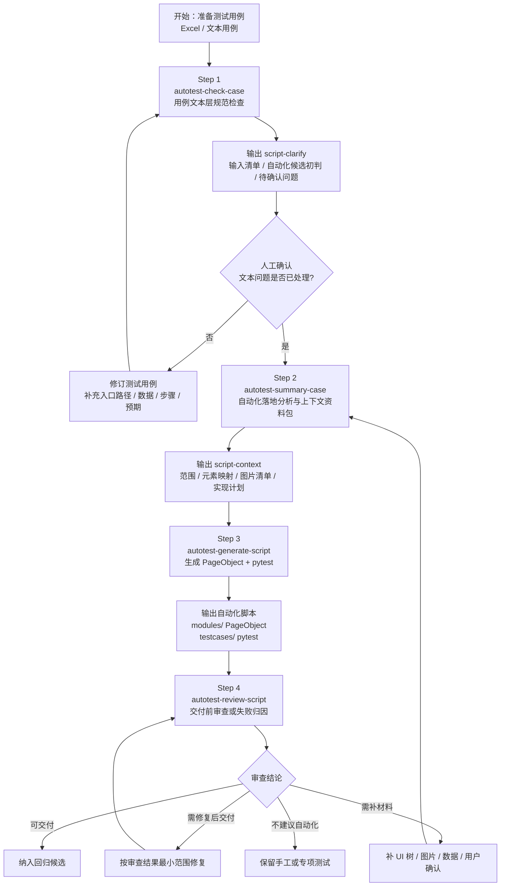
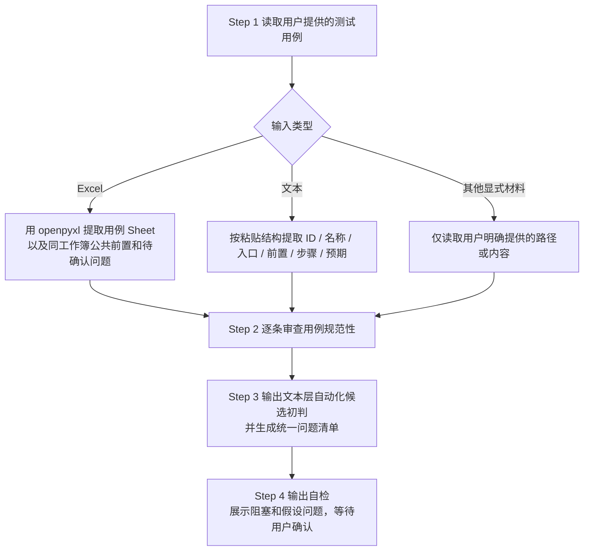
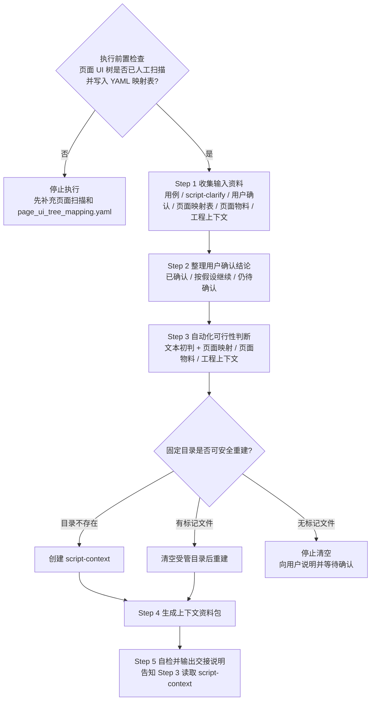
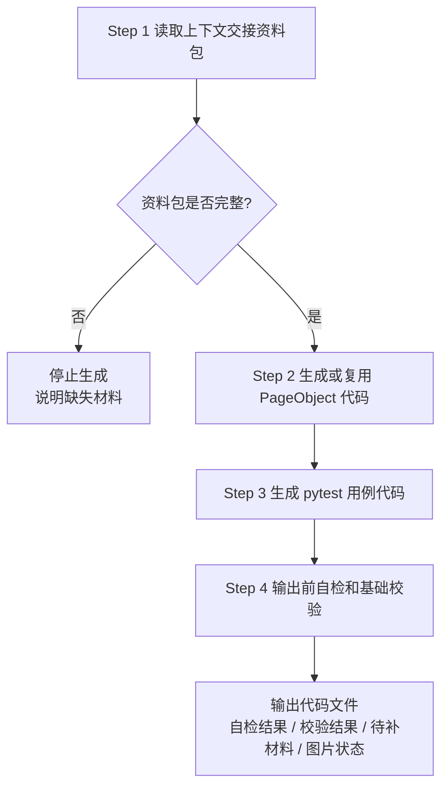
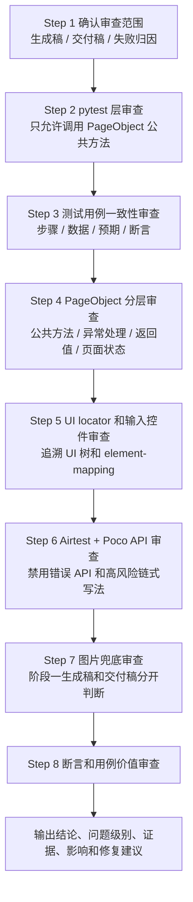
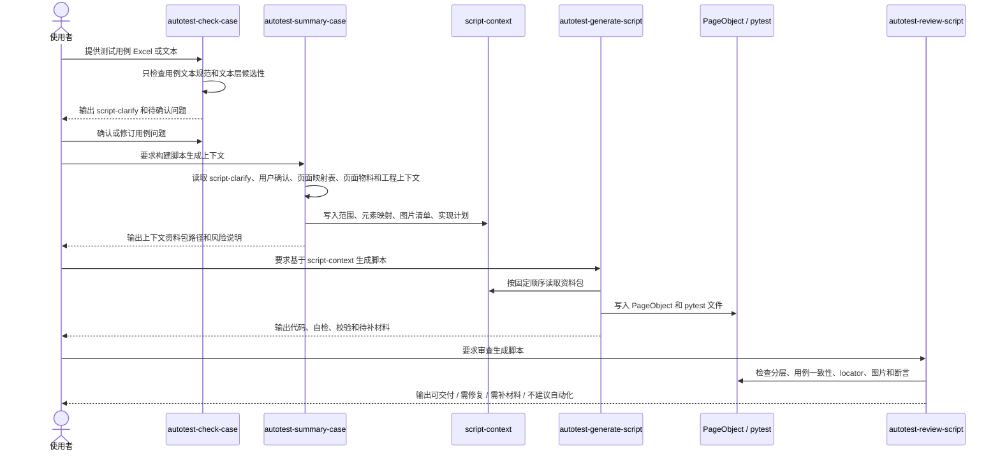

# 测试用例转自动化脚本四段式工作流使用说明

本文档面向需要把测试用例 Excel 或文本用例转成 Airtest + Poco + pytest 自动化脚本的团队成员。整套流程由 4 个 Skill 串联完成：

1. `autotest-check-case`：只检查测试用例文本本身是否规范、清晰、完整、可复现、可观察，并给出文本层自动化候选初判。
2. `autotest-summary-case`：读取用例检查结果、用户确认、人工维护的页面映射表、页面物料和工程上下文，完成自动化落地可行性分析，并生成脚本上下文资料包。
3. `autotest-generate-script`：基于上下文资料包生成 PageObject 代码和 pytest 用例代码。
4. `autotest-review-script`：对生成脚本做交付前审查或失败后归因，判断是否可运行、可交付、需补材料或需修复。

核心原则：先确认测试用例文本，再确认工程落地条件，最后生成脚本并独立审查。不要让 AI 跳过上下文资料包直接写脚本。

## 一、适用范围

适用于以下场景：

| 场景 | 是否适用 | 说明 |
| --- | --- | --- |
| 检查测试用例是否适合进入自动化分析 | 适用 | 只看测试用例文本，不读取工程文件 |
| 构建脚本生成上下文 | 适用 | 读取页面映射、UI 树、截图、PageObject、pytest、图片资产和工程规则 |
| 生成 Airtest + Poco + pytest 脚本 | 适用 | 输出 PageObject 代码文件和 pytest 测试文件 |
| 审查生成脚本是否可交付 | 适用 | 检查分层、断言、locator、图片兜底、用例一致性和运行风险 |
| 需求质量审查 | 不适用 | 需求审查属于 PRD 转用例流程 |
| 生成测试用例 Excel | 不适用 | 测试用例生成属于 `autotest-generate-cases` |

典型输入：

| 输入 | 用途 |
| --- | --- |
| 测试用例 Excel | Step 1 的主要输入，通常来自 PRD 转测试用例流程 |
| 文本测试用例 | 可作为 Step 1 输入 |
| `testcase-workflow/script-clarify/` | Step 2 读取 Step 1 的文本层检查结果 |
| `tools/pages/page_ui_tree_mapping.yaml` | Step 2 读取人工维护的页面名称与 UI 树映射关系 |
| 页面 UI 树和截图物料 | Step 2 判断元素定位和页面可达性 |
| 工程上下文 | Step 2 判断 PageObject、pytest、图片资产和工程规则 |
| `testcase-workflow/script-context/` | Step 3 的必读输入 |
| 生成的 PageObject / pytest 文件 | Step 4 的审查对象 |

## 二、Skill 与参考文件

| 步骤 | Skill | 主要参考文件 |
| --- | --- | --- |
| 1 | `autotest-check-case` | 无独立 reference，规则集中在 `SKILL.md` |
| 2 | `autotest-summary-case` | 无独立 reference，规则集中在 `SKILL.md` |
| 3 | `autotest-generate-script` | `references/autotest-generate-script-reference.md` |
| 4 | `autotest-review-script` | 无独立 reference，规则集中在 `SKILL.md` |

## 三、整体流程总览



一句话理解：

```text
测试用例 -> 文本层检查 -> 人工确认 -> 工程落地分析 -> 上下文资料包 -> 生成脚本 -> 独立审查 -> 回归候选
```

## 四、角色分工

| 角色 | 主要职责 |
| --- | --- |
| 测试 | 提供测试用例，确认用例文本问题，评审自动化范围 |
| 自动化测试 | 提供页面物料、工程上下文、测试数据和脚本落地判断 |
| AI | 严格按四段式流程检查、整理、生成、审查，不跳过上下文包 |
| 研发 | 补充稳定控件标识、状态构造接口、测试数据接口或硬件控制能力 |
| 产品 | 当测试用例暴露业务规则或文案未确认时补充结论 |

## 五、Step 1：检查测试用例文本

### 触发 Skill

使用 `autotest-check-case`。当用户提到以下意图时触发：

- 检查测试用例规范
- 用例规范检查
- 检查用例是否适合自动化
- 用例自动化候选检查
- 测试用例质量检查
- automation candidate check

示例提示词：

```text
请使用 autotest-check-case 检查这份测试用例：outputs/testcases/demo.xlsx
只检查用例文本本身是否清晰、完整、可复现、可观察，并输出文本层自动化候选初判。
```

Claude Code 中也可以直接输入：

```text
/autotest-check-case outputs/testcases/demo.xlsx
```

### 职责边界

| 做什么 | 不做什么 |
| --- | --- |
| 读取用户显式提供的测试用例 Excel、文本用例或同类材料 | 不主动扫描工程目录找用例 |
| 检查用例 ID、名称、入口路径、前置、数据、步骤、预期、平台差异等 | 不读取页面映射表、UI 树、截图、PageObject、pytest、图片目录 |
| 给出文本层自动化候选初判 | 不判断工程可实现性 |
| 输出问题清单并等待用户确认 | 不生成脚本，不构建上下文资料包 |

如果用户没有提供测试用例路径或文本，必须先要求用户补充输入，不要扫描工程目录。

### 固定输出目录

检查结果必须输出到当前工作目录下：

```text
testcase-workflow/script-clarify/
```

目录内必须包含标记文件：

```text
.managed-by-autotest-check-case
```

清理规则：

| 情况 | 处理方式 |
| --- | --- |
| 目录不存在 | 直接创建 |
| 目录存在且有 `.managed-by-autotest-check-case` | 执行前先清空，再重新生成 |
| 目录存在但没有标记文件 | 不要清空，先向用户说明并等待确认 |

### 强制执行流程



### 审查维度

| 维度 | 检查重点 |
| --- | --- |
| 用例 ID | 是否唯一、稳定、可追踪 |
| 用例名称 | 是否表达一个明确验证目标 |
| 模块 / 功能点 | 是否能看出所属业务模块和功能点 |
| 功能入口路径 | 是否从首页到操作页面写完整，是否跳步或入口不唯一 |
| 前置条件 | 是否明确账号、角色、权限、数据、设备或平台状态 |
| 测试数据 | 是否具体、稳定、可准备、可恢复，成本是否合理 |
| 操作步骤 | 是否 UI 层面可执行、顺序清晰、可复现、无跳步 |
| 预期结果 | 是否具体、可观察、可断言 |
| UI 尺寸 / 视觉规格 | 是否更适合手工或视觉专项测试 |
| 平台差异 | iOS、Android、Web 等差异是否说明 |
| 账号 / 角色差异 | 多账号、被分享人、管理员等是否明确 |
| 数据清理 | 新增、修改、删除数据后是否说明恢复方式 |
| 独立性 | 是否依赖前一条用例或不可控外部状态 |
| 自动化候选性 | 是否可复现、可观察、可断言、数据可准备 |

### 文本层自动化候选初判

| 初判结论 | 判定条件 | 下一步 |
| --- | --- | --- |
| 可进入自动化落地分析 | 文本清晰，入口、前置、步骤、预期、数据足够明确，预期可观察 | 交给 `autotest-summary-case` 做工程落地分析 |
| 需修订/确认后进入 | 文案、规则、步骤、数据、平台、角色等存在含糊点 | 写入问题清单，等待用户确认或修订 |
| 建议保留手工或专项测试 | 预期不可客观观察，主要验证视觉尺寸，依赖不可控状态，或数据准备成本高且收益不高 | 保留手工或转专项测试 |
| 信息不足，无法判断 | 缺少核心字段，无法判断步骤、数据或预期 | 补充用例内容后重新检查 |

### 输出文件

| 文件 | 职责 |
| --- | --- |
| `.managed-by-autotest-check-case` | 标记目录由本 Skill 管理 |
| `input-inventory.md` | 本次读取的用例输入、来源、状态、范围和缺失项 |
| `automation-readiness.md` | 每条用例的文本层自动化候选初判、依据、阻塞项、待确认项和建议下一步 |
| `clarify-issues.md` | 统一问题清单，包含用例质量问题、待确认问题、假设授权请求和待补充项 |

### Step 1 注意事项

- 只看用例文本和同一用例文档内的说明。
- 不读取页面映射表、UI 树、截图、PageObject、pytest、图片目录、`CLAUDE.md`、`README.md` 或其他工程文件。
- 初判只代表文本质量，不代表最终工程可实现性。
- 数据准备成本为高或很高，且不是高价值核心回归时，默认建议保留手工或专项测试。

## 六、人工确认环节

Step 1 输出后，用户需要确认或修订问题清单。建议按问题逐条回复：

```text
针对 autotest-check-case 的问题清单，我确认如下：

P1：入口路径补充为 首页 -> 听蓝 Tab -> 标签管理。
P2：测试数据使用专用标签「自动化标签_001」，用例执行后删除。
P3：弱网场景本期保留手工，不进入自动化。
P4：文案按「网络异常，请稍后重试」断言。
```

确认内容建议包含：

| 内容 | 示例 |
| --- | --- |
| 入口路径补充 | 从首页到目标操作页面的完整路径 |
| 测试数据方案 | 专用账号、专用标签、专用录音、清理方式 |
| 文案确认 | Toast、弹窗、按钮、空态等精确文案 |
| 平台差异 | iOS 和 Android 是否同路径同预期 |
| 自动化范围授权 | 哪些用例进入自动化，哪些保留手工 |
| 假设授权 | 允许 AI 按某个明确假设继续 |

## 七、Step 2：构建脚本生成上下文

### 触发 Skill

使用 `autotest-summary-case`。当用户提到以下意图时触发：

- 构建自动化上下文
- 整理脚本生成上下文
- 交接到生成脚本
- 自动化上下文资料包
- 自动化落地分析
- automation context build
- script context handoff

示例提示词：

```text
请使用 autotest-summary-case，基于 script-clarify 的检查结果、我的确认回复、人工维护的页面映射表、页面物料和工程上下文，构建脚本生成上下文资料包。
```

Claude Code 中也可以直接输入：

```text
/autotest-summary-case
基于 script-clarify、用户确认、页面映射表、页面物料和工程上下文，构建脚本生成上下文资料包。
```

### 职责边界

| 做什么 | 不做什么 |
| --- | --- |
| 读取 Step 1 输出和用户确认 | 不重新做测试用例文本规范审查 |
| 读取页面映射表、UI 树、截图、PageObject、pytest、正式图片目录和工程规则 | 不全量塞入无关代码或图片清单 |
| 完成自动化落地可行性分析 | 不生成脚本代码 |
| 生成供 `autotest-generate-script` 读取的上下文资料包 | 不替用户新增确认结论 |

如果 `testcase-workflow/script-clarify/` 不存在，应提示用户先执行 `/autotest-check-case`。

### 执行前置条件

执行 Step 2 前，必须先完成人工页面物料准备：

| 前置条件 | 要求 |
| --- | --- |
| 人工扫描页面 UI 树 | 已针对本次候选自动化用例涉及到的页面完成 UI 树扫描 |
| 页面名称已确认 | 测试用例中的业务页面名称已和实际页面物料对齐 |
| 映射表已写入 | 页面名称与 UI 树、截图、prompt 等物料路径已写入 `tools/pages/page_ui_tree_mapping.yaml` |
| 映射范围可追溯 | 每条候选用例涉及的页面都能在映射表中找到对应记录 |

如果映射表不存在，或候选用例涉及的页面没有完成映射，Step 2 不应继续生成上下文资料包，应先补充页面扫描和 YAML 映射。

### 固定输出目录

资料包必须输出到当前工作目录下：

```text
testcase-workflow/script-context/
```

目录内必须包含标记文件：

```text
.managed-by-autotest-summary-case
```

清理规则：

| 情况 | 处理方式 |
| --- | --- |
| 目录不存在 | 直接创建 |
| 目录存在且有 `.managed-by-autotest-summary-case` | 执行前先清空，再重新生成 |
| 目录存在但没有标记文件 | 不要清空，先向用户说明并等待确认 |

### 强制执行流程



### 自动化可行性结论

| 结论 | 条件 | 后续动作 |
| --- | --- | --- |
| 立即自动化 | 文本层无未解决阻塞，页面映射存在，关键 UI 物料存在，断言可观测，数据稳定，元素可定位 | 进入元素映射和实现计划 |
| 补充材料后自动化 | 缺 UI 树、截图、页面映射、测试数据、断言文案、正式图片或用户确认，且会影响脚本稳定 | 写入待补充清单 |
| 暂不自动化 | 文本层建议保留手工且未被用户改判，需求不稳定，收益低，维护成本高，断言不可观察 | 不进入脚本生成 |
| 需要研发支持 | 缺稳定控件标识、状态构造接口、测试数据接口或硬件控制能力 | 提出可测性诉求 |

### 资料包文件结构

```text
testcase-workflow/
└── script-context/
    ├── .managed-by-autotest-summary-case
    ├── handoff-summary.md
    ├── project-structure.md
    ├── automation-scope.md
    ├── element-mapping.md
    ├── image-review-list.md
    ├── implementation-plan.md
    └── user-confirmations.md
```

| 文件 | 职责 |
| --- | --- |
| `handoff-summary.md` | 交接入口，记录范围、确认数量、风险、缺图摘要和下游读取顺序 |
| `project-structure.md` | 项目关键路径和工程约定，包括 PageObject、pytest、图片、规则文件等 |
| `automation-scope.md` | 可立即自动化和未进入立即自动化的用例清单 |
| `element-mapping.md` | 立即自动化用例的页面元素映射、定位方式、图片状态和来源 |
| `image-review-list.md` | 脚本实际引用或 popup 链路可能用到的图片人工确认清单 |
| `implementation-plan.md` | PageObject 方法设计、断言覆盖表和 pytest 编排计划 |
| `user-confirmations.md` | 用户确认、补充、假设授权及其对脚本生成的影响 |

### Step 2 注意事项

- Step 2 执行前必须确认本次候选用例涉及页面已完成 UI 树扫描，并已写入 `tools/pages/page_ui_tree_mapping.yaml`。
- `autotest-summary-case` 只读取和校验已有映射，不负责替用户扫描页面或凭页面名称猜 UI 树。
- `automation-readiness.md` 中的文本层初判只是输入，不是最终脚本生成范围。
- 第一阶段仍未确认的问题不得被提升为“立即自动化”。
- 每条立即自动化用例都必须有元素映射和实现计划。
- 缺正式图片且没有稳定 Poco locator 的步骤，不得列入立即自动化。
- 有稳定 locator 但缺正式图片兜底时，可以列入立即自动化，但必须在资料包中标记风险、候选图路径、阶段一引用名和待补图状态。
- `implementation-plan.md` 的 pytest 编排计划只能写 PageObject 公共方法，不能出现私有方法、locator、图片名、坐标或底层 Poco 对象。

## 八、Step 3：生成自动化脚本

### 触发 Skill

使用 `autotest-generate-script`。当用户提到以下意图时触发：

- 生成脚本
- 写自动化脚本
- 用例转脚本
- 脚本生成
- generate script
- testcase to script

示例提示词：

```text
请使用 autotest-generate-script，读取 testcase-workflow/script-context/ 上下文资料包，生成 Airtest + Poco + pytest 自动化脚本。
```

Claude Code 中也可以直接输入：

```text
/autotest-generate-script
读取 testcase-workflow/script-context/，生成 PageObject 和 pytest 用例。
```

### 职责边界

| 做什么 | 不做什么 |
| --- | --- |
| 读取 `script-context/` 资料包并生成代码 | 不重新做测试用例文本规范审查 |
| 生成或复用 PageObject 方法 | 不重新判断自动化范围 |
| 生成 pytest 用例编排 | 不重新做元素映射 |
| 执行语法校验和收集校验 | 不擅自新增或修改正式图片目录 |

### 固定输入目录和读取顺序

固定输入目录：

```text
testcase-workflow/script-context/
```

读取顺序：

1. `handoff-summary.md`
2. `project-structure.md`
3. `automation-scope.md`
4. `element-mapping.md`
5. `image-review-list.md`
6. `implementation-plan.md`
7. `user-confirmations.md`

如果目录不存在、缺少 `.managed-by-autotest-summary-case`，或缺少 `image-review-list.md`，必须停止生成并提示用户重新执行 `/autotest-summary-case`。

如果工程根目录存在 `CLAUDE.md`，生成代码前必须直接读取。`project-structure.md` 是摘要，不能完全替代工程原始规则。

### 强制执行流程



### PageObject 生成规则

| 规则 | 要求 |
| --- | --- |
| 写入位置 | 按 `project-structure.md` 和现有工程风格写入 PageObject 目录 |
| 方法分层 | 单页动作可封装为私有方法，对外暴露稳定公共业务方法 |
| 返回值 | 公共方法必须捕获可预期失败并返回 `True` / `False` |
| 平台差异 | 按项目约定显式处理 Android / iOS 差异 |
| 动态数据 | 从配置或测试数据读取，不硬编码账号、密码、组织、固定业务数据 |
| 页面跳转 | 跳转、返回、刷新后必须重新获取 Poco 节点 |
| 输入控件 | locator 必须来自 `element-mapping.md` 中 UI 树真实节点来源 |
| 图片兜底 | 必须先查 `image-review-list.md`，不得自行编图片名 |
| API 使用 | 禁止使用 Selenium 风格 `get_attribute()`，应使用项目支持的 Poco API 或可观察状态断言 |

### pytest 生成规则

| 规则 | 要求 |
| --- | --- |
| 生成范围 | 只为 `automation-scope.md` 中“立即自动化”的用例生成脚本 |
| 用例层职责 | 只做流程编排和断言入口 |
| 调用方式 | 只调用 PageObject 公共业务方法、fixture、marker 和 skip 条件 |
| 缺材料用例 | 默认不生成；只有实现计划明确要求占位时才生成 `pytest.skip` |
| 分层约束 | 多平台差异在 PageObject 中处理，不在测试函数复制两套流程 |

pytest 用例层禁止出现：

- PageObject 私有方法调用，例如 `page._xxx()`。
- `base_action`、`baseutil`、`android_poco`、`ios_poco`、`poco(`。
- `IOSElements`、`AndroidElements`。
- locator 字符串、图片文件名、坐标、Airtest `Template`。
- `_handle_platform_popup*` 调用。

### 输出前自检和基础校验

| 检查项 | 通过标准 |
| --- | --- |
| 需求来源 | 脚本能追溯到测试用例或需求功能点 |
| 分层正确 | 业务动作在 PageObject，pytest 只编排流程 |
| 测试层干净 | pytest 不直接调用私有方法、Poco、base_action、图片名或坐标 |
| 定位可靠 | 优先稳定 Poco locator，不稳定步骤有图片兜底策略 |
| 图片合规 | 不擅自修改正式图片目录，图片名可追溯到 `image-review-list.md` |
| 输入控件真实 | 输入框 locator 与 UI 树来源一致，未把 placeholder 当输入控件 |
| Poco API 合规 | 未使用 `get_attribute()` 等非本项目 API |
| 失败可诊断 | 日志、返回值、断言信息能支持定位问题 |

基础校验：

| 校验 | 说明 |
| --- | --- |
| Python 语法校验 | 对新增或修改的 Python 文件运行 `python -m py_compile` |
| pytest 收集校验 | 对相关测试文件运行 `pytest --collect-only` |
| 单条 smoke | 只有设备和环境可用且用户要求时再运行 |

## 九、Step 4：审查生成脚本

### 触发 Skill

使用 `autotest-review-script`。当用户需要交付前审查、失败归因或脚本质量检查时触发：

- 审查生成脚本
- 分析自动化脚本失败原因
- 检查 PageObject / pytest 分层
- 检查脚本步骤和测试用例是否一致
- 检查图片兜底资产
- 检查 locator 是否可追溯到 UI 树
- 判断脚本是否可以运行或交付

示例提示词：

```text
请使用 autotest-review-script 审查刚生成的 PageObject 和 pytest 文件，判断是否可交付，并重点检查用例一致性、分层、locator、图片兜底和断言有效性。
```

Claude Code 中也可以直接输入：

```text
/autotest-review-script
审查刚生成的自动化脚本，输出交付结论和问题清单。
```

### 默认行为

默认只审查并输出报告，不修改脚本。只有用户明确要求“修改”“修复”“按审查结果改”时，才按最小必要范围改代码。

### 优先读取材料

| 顺序 | 材料 |
| --- | --- |
| 1 | 工程根目录 `CLAUDE.md`，作为工程约定和交付红线 |
| 2 | `testcase-workflow/script-context/` 上下文资料包 |
| 3 | 源测试用例或实现计划中的步骤和预期 |
| 4 | 生成或修改的 PageObject 文件 |
| 5 | 生成或修改的 pytest 文件 |
| 6 | 页面 UI 树、截图和 crops |
| 7 | 正式图片目录 |
| 8 | 用户提供的运行日志、pytest 输出、失败截图或当前 UI 树 |

如果缺少源测试用例或 `implementation-plan.md` 中没有操作步骤 / 预期映射，必须说明无法完成“测试用例一致性审查”。

### 审查流程



### 审查结论

| 结论 | 含义 |
| --- | --- |
| 可交付 | 静态审查通过，风险可接受 |
| 需修复后交付 | 有明确代码问题，修复后可继续 |
| 需补材料 | 缺 UI 树、正式图片、测试数据或用户确认，不能可靠判断 |
| 不建议自动化 | 用例本身不适合 UI 自动化或维护成本明显过高 |

### 问题级别

| 级别 | 含义 |
| --- | --- |
| P0 | 会导致脚本无法启动、无法收集、必现运行失败 |
| P1 | 主流程高概率失败或断言无效 |
| P2 | 稳定性或维护性风险，短期可运行但容易波动 |
| P3 | 命名、日志、可读性、轻微结构问题 |

每个问题必须包含：

| 字段 | 内容 |
| --- | --- |
| 文件行号 | 指向具体 PageObject 或 pytest 代码 |
| 证据 | 代码、日志、UI 树、资料包或源用例中的证据 |
| 影响 | 会导致什么运行失败、误判或维护风险 |
| 建议修复 | 最小必要修复方案 |

### 报告保存

默认输出到对话中。如果用户要求保存报告，写入：

```text
testcase-workflow/script-review/review-report.md
```

## 十、四步时序图



## 十一、推荐使用话术

### 第一次：检查测试用例

```text
请使用 autotest-check-case 检查这份测试用例：outputs/testcases/demo.xlsx

要求：
1. 只检查用例文本本身。
2. 输出 input-inventory.md、automation-readiness.md、clarify-issues.md。
3. 给出每条用例的文本层自动化候选初判。
4. 不要读取工程文件，不要生成脚本。
```

### 第二次：确认用例问题

```text
针对 clarify-issues.md，我确认如下：

P1：入口路径补充为 xxx。
P2：测试数据使用 xxx，执行后通过 xxx 清理。
P3：该视觉尺寸用例保留手工，不进入自动化。
P4：按假设 xxx 继续。

请先不要生成脚本，等待我要求构建上下文。
```

### 第三次：构建脚本上下文

```text
请使用 autotest-summary-case，基于 script-clarify、我的确认回复、tools/pages/page_ui_tree_mapping.yaml、UI 树、截图、PageObject、pytest、图片目录和工程规则，构建脚本生成上下文资料包。
输出到 testcase-workflow/script-context/。
```

### 第四次：生成脚本

```text
请使用 autotest-generate-script，读取 testcase-workflow/script-context/，只为 automation-scope.md 中“立即自动化”的用例生成 PageObject 和 pytest 脚本。

要求：
1. 先读取 handoff-summary、project-structure、automation-scope、element-mapping、image-review-list、implementation-plan、user-confirmations。
2. pytest 层只调用 PageObject 公共方法。
3. 不擅自新增或修改 images。
4. 生成后运行 py_compile 和 pytest --collect-only。
```

### 第五次：审查脚本

```text
请使用 autotest-review-script 审查刚生成的脚本。

重点检查：
1. 脚本步骤和源测试用例是否一致。
2. pytest 是否直接调用私有方法、locator、图片名或底层 Poco。
3. PageObject 公共方法是否有返回值、异常处理和目标页面校验。
4. locator 是否能追溯到 UI 树。
5. 图片兜底是否符合 image-review-list 和 images 交付要求。
6. 断言是否覆盖测试用例预期。
```

## 十二、常见错误与规避方式

| 错误 | 后果 | 规避方式 |
| --- | --- | --- |
| 跳过 `autotest-check-case` 直接构建上下文 | 用例文本问题未确认，后续脚本范围不可靠 | 先做文本层用例检查 |
| Step 1 主动读取工程文件 | 混淆文本质量和工程落地条件 | Step 1 只读取用户显式提供的用例材料 |
| Step 2 执行前未维护页面映射表 | 页面名和 UI 树无法追溯，后续元素映射容易失真 | 先人工扫描相关页面 UI 树，并写入 `tools/pages/page_ui_tree_mapping.yaml` |
| Step 2 把文本层初判当最终范围 | 未确认或不适合自动化的用例被错误提升 | Step 2 必须结合用户确认、页面映射表、页面物料和工程上下文重新判断 |
| `script-context/` 缺少 `image-review-list.md` | Step 3 可能乱编图片名 | 缺失时停止生成，重新执行 `autotest-summary-case` |
| pytest 直接写 locator 或图片名 | 分层失效，维护成本高 | 先封装 PageObject 公共方法，pytest 只调用公共方法 |
| 把 placeholder 当输入框 locator | 输入失败或找不到控件 | 以 UI 树真实可编辑节点为准 |
| 使用 `get_attribute()` | Poco 对象不支持 Selenium API | 使用项目支持的 Poco API 或 UI 状态断言 |
| 缺正式图片却声称可交付 | 真机运行会报图片不存在 | 交付态必须确认图片在正式目录存在 |
| 审查时只看代码结构不看源用例 | 可能脚本能跑但验证错东西 | 必须做测试用例一致性审查 |

## 十三、交付物检查清单

### Step 1 完成标准

- 已读取用户显式提供的测试用例。
- 已生成 `testcase-workflow/script-clarify/`。
- 目录内存在 `.managed-by-autotest-check-case`。
- 已生成 `input-inventory.md`、`automation-readiness.md`、`clarify-issues.md`。
- 每条读取到的用例都出现在 `automation-readiness.md`。
- 没有基于工程物料或代码做判断。

### Step 2 完成标准

- 已读取 `script-clarify/` 和用户确认。
- 已确认本次候选用例涉及页面已人工扫描 UI 树。
- 已读取 `tools/pages/page_ui_tree_mapping.yaml`，且候选用例涉及页面均有映射记录。
- 已按范围读取页面物料和工程上下文。
- 已生成 `testcase-workflow/script-context/`。
- 目录内存在 `.managed-by-autotest-summary-case`。
- 已生成 7 个资料包文件。
- 每条“立即自动化”用例都有元素映射和实现计划。
- 图片兜底、候选图、建议正式名都能在 `image-review-list.md` 追溯。
- pytest 编排计划没有私有方法、locator、图片名、坐标或底层 Poco 对象。

### Step 3 完成标准

- 已按固定顺序读取 `script-context/`。
- 只为“立即自动化”用例生成脚本。
- PageObject 代码写入项目页面对象目录。
- pytest 用例写入项目测试用例目录。
- pytest 层没有直接调用私有方法、locator、图片名、坐标或底层 Poco。
- 新增或修改的 Python 文件通过语法校验。
- 相关测试文件通过 pytest 收集校验，或说明未运行原因。
- 待补充图片、测试数据、UI 树等材料已明确列出。

### Step 4 完成标准

- 已明确审查范围。
- 已做用例一致性审查。
- 已审查 pytest 分层、PageObject 分层、locator、输入控件、Poco API、图片兜底和断言有效性。
- 每个问题都有级别、文件行号、证据、影响和建议修复。
- 已给出最终结论：可交付、需修复后交付、需补材料或不建议自动化。

## 十四、下游回归衔接说明

通过 Step 4 审查后，脚本可以进入回归候选。进入回归前建议确认：

| 项目 | 要求 |
| --- | --- |
| 测试数据 | 专用、稳定、可清理，不依赖共享线上数据 |
| 页面归位 | 每条用例能从稳定入口进入目标页面 |
| 断言 | 覆盖源测试用例主要预期结果 |
| marker | 已按模块、P0、回归范围添加 |
| 图片资产 | 交付态引用图片均已在正式目录存在 |
| 失败归因 | 日志、截图、UI 树和返回值能支持定位问题 |
| 维护边界 | UI 改版优先更新 PageObject 和页面映射，不批量改测试函数 |

完整链路：

```text
autotest-check-prd -> autotest-summary-prd -> autotest-generate-cases
-> autotest-check-case -> autotest-summary-case -> autotest-generate-script
-> autotest-review-script -> 回归候选
```
