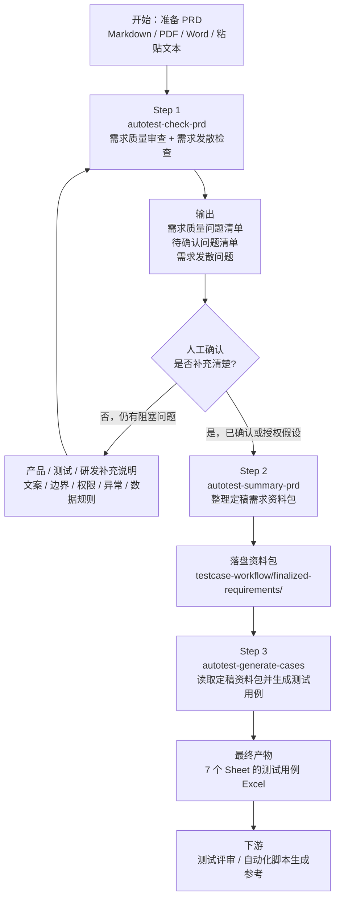
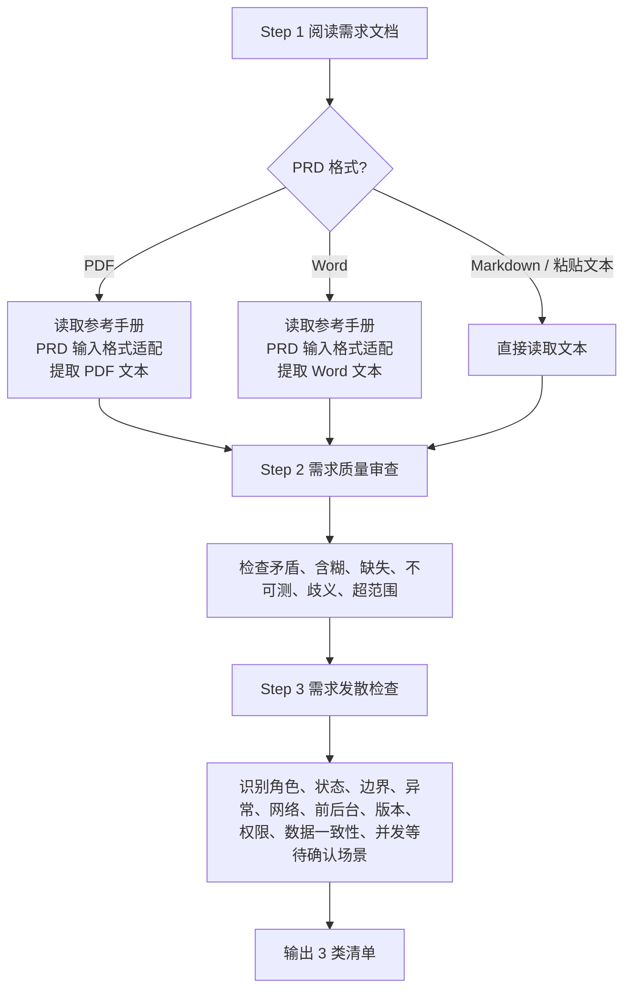
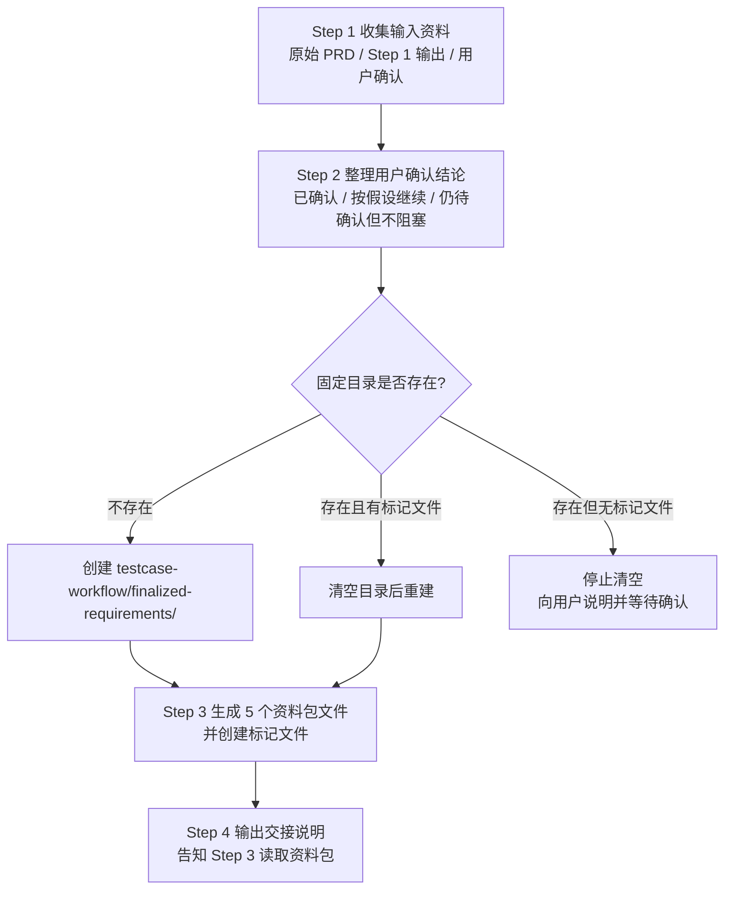
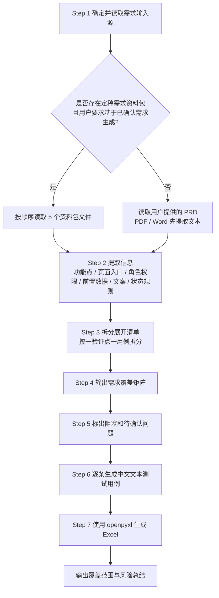
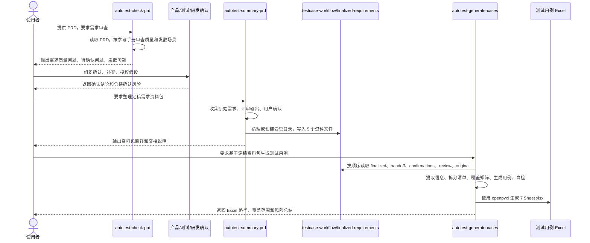

# PRD 转测试用例三段式工作流使用说明

本文档面向需要把产品需求文档转成可供自动化脚本生成参考资料的团队成员。整套流程由 3 个 Skill 串联完成：

1. `autotest-check-prd`：分析 PRD，输出需求质量问题、待确认问题和发散问题。
2. `autotest-summary-prd`：整理原始需求、评审结果和用户确认，生成定稿需求资料包。
3. `autotest-generate-cases`：基于 PRD 或定稿需求资料包生成中文测试用例 Excel。

核心原则：先把需求问清楚，再沉淀定稿资料包，最后生成结构化 Excel。不要让 AI 在需求不明确时替产品做决定。

## 一、适用范围

适用于以下场景：

| 场景 | 是否适用 | 说明 |
| --- | --- | --- |
| PRD 质量审查 | 适用 | 检查矛盾、含糊、缺失、不可测、歧义、超范围等问题 |
| PRD 确认后整理 | 适用 | 把需求、AI 评审输出和人工确认沉淀为资料包 |
| 手工测试用例生成 | 适用 | 输出 7 个 Sheet 的 Excel，供测试评审和自动化脚本生成参考 |
| 自动化脚本生成 | 不适用 | 本流程只到测试用例 Excel，不生成 pytest、Airtest、locator、SQL 或 API 代码 |
| 无需求文档的纯技术任务 | 不适用 | 需要先补充业务需求、页面入口、状态规则和可观测预期 |

支持的 PRD 输入形式：

| 格式 | 处理方式 |
| --- | --- |
| Markdown `.md` | 直接读取 |
| PDF | 先提取文本，再进行分析或生成 |
| Word `.docx` | 先提取段落和表格文本，再进行分析或生成 |
| 飞书/钉钉文档 | 用户复制文本到对话中 |
| 口述需求整理稿 | 可使用，但需要标注格式不标准，必要时补充确认 |

## 二、Skill 与参考文件

| 步骤 | Skill | 主要参考文件 |
| --- | --- | --- |
| 1 | `autotest-check-prd` | `references/autotest-check-prd-reference.md` |
| 2 | `autotest-summary-prd` | 无独立 reference，规则集中在 `SKILL.md` |
| 3 | `autotest-generate-cases` | `references/autotest-generate-cases-reference.md` |

## 三、整体流程总览



一句话理解：

```text
PRD -> AI 评审问题 -> 人工确认 -> 定稿资料包 -> 测试用例 Excel -> 自动化脚本生成参考
```

## 四、角色分工

| 角色 | 主要职责 |
| --- | --- |
| 产品 | 提供 PRD，确认需求矛盾、缺失、含糊、文案、边界和异常处理 |
| 测试 | 发起流程，评审 AI 输出的问题清单和 Excel 用例，补充测试数据 |
| AI | 按 Skill 协议执行审查、整理和生成，不替产品擅自决定业务规则 |
| 研发 | 在涉及实现限制、版本兼容、接口状态、可测性支持时补充说明 |
| 自动化测试 | 使用最终 Excel 作为脚本生成的业务参考资料 |

## 五、Step 1：分析 PRD

### 触发 Skill

使用 `autotest-check-prd`。当用户提到以下意图时触发：

- 需求评审
- 需求质量审查
- 需求把关
- 需求发散
- PRD 审查
- 需求问题清单
- 待确认问题

示例提示词：

```text
请使用 autotest-check-prd 审查这个 PRD：/path/to/需求文档.pdf
重点输出需求质量问题、待确认问题和需求发散问题。
```

Claude Code 中也可以直接输入：

```text
/autotest-check-prd /path/to/需求文档.pdf
```

### 输入

| 输入 | 说明 |
| --- | --- |
| 原始 PRD | PDF、Word、Markdown 或粘贴文本 |
| 项目背景，可选 | 如果 PRD 上下文不足，可补充业务背景 |
| 审查重点，可选 | 比如重点关注权限、网络、前后台、数据一致性等 |

### 强制执行流程



### 输出

Step 1 最终输出 3 类清单：

| 输出 | 字段 |
| --- | --- |
| 需求质量问题 | 序号、问题描述、关联功能点、问题类型、影响范围、原文出处、建议确认人、处理建议 |
| 待确认问题 | 序号、问题、关联功能点、影响、原文出处、建议确认人、问题类型标签、处理方式标签 |
| 需求发散问题 | 序号、发散场景、关联功能点、为什么需要确认、原文依据、建议确认人、处理方式标签 |

### 问题类型标签

| 标签 | 含义 | 典型问题 |
| --- | --- | --- |
| 🔴矛盾 | 同一功能在不同位置描述不一致 | A 处说超 60 秒自动保存，B 处说不限时长 |
| 🟡含糊 | 描述无法确定唯一预期行为 | 适当提示、合理时间、尽量减少 |
| 🔴缺失 | 关键场景、异常、边界或文案未提及 | 只写成功流程，没写失败场景 |
| 🟡不可测 | 无法在 UI 或客观结果上验证 | 体验流畅、界面美观 |
| 🟡歧义 | 同一句话有多种理解 | 点击后返回首页，到底是替换还是新开 |
| ⚪超范围 | 描述技术实现而非用户行为 | 调用某接口写入某数据库表 |

### 处理方式标签

| 标签 | 含义 | 处理建议 |
| --- | --- | --- |
| 🔴阻塞 | 不确认就无法生成可靠用例 | 必须先找产品或相关负责人确认 |
| 🟡假设 | 可以按某个假设继续 | 必须写明假设，后续由用户确认 |
| 🟡风险 | 可继续生成，但覆盖可能不完整 | 在交接资料和 Excel 中保留风险 |
| ⚪待补充 | 当前不阻塞，但执行或自动化前需要补充 | 后续补齐即可 |

### Step 1 注意事项

- 只做需求审查和发散，不生成测试用例。
- 发散问题必须有原文依据，不能凭空扩展产品范围。
- 不能把发散问题当成已确认需求。
- 需求不明确时必须标注问题，不要替产品做决定。

## 六、人工确认环节

Step 1 后必须由人和 AI 对问题清单进行确认。这个环节不属于某一个 Skill，但它决定 Step 2 的输入质量。

建议按以下方式回复 AI：

```text
针对待确认问题，我确认如下：

1. Q1：按方案 A 处理，Toast 文案为「网络异常，请稍后重试」。
2. Q2：删除弹窗需要取消和继续两个按钮，点击取消关闭弹窗，不删除数据。
3. Q3：弱网场景先按风险处理，不阻塞本次用例生成。
4. Q4：没有多角色权限差异，统一按普通用户处理。
5. Q5：文案暂未定稿，请在用例中标注「文案待确认」。
```

确认内容建议包含：

| 内容 | 示例 |
| --- | --- |
| 已确认结论 | 删除后标签分组消失，但录音不删除 |
| 精确文案 | Toast 显示「网络异常，请稍后重试」 |
| 假设授权 | 若需求未写弱网表现，先按提交失败并提示处理 |
| 不阻塞风险 | 多端并发暂不覆盖，不阻塞本轮生成 |
| 仍待确认 | 运营后台权限矩阵待产品补充 |

## 七、Step 2：整理定稿需求资料包

### 触发 Skill

使用 `autotest-summary-prd`。当用户提到以下意图时触发：

- 定稿需求
- 整理确认后的需求
- 交接到生成测试用例
- 测试用例输入资料包
- finalize requirements

示例提示词：

```text
请使用 autotest-summary-prd，把原始 PRD、刚才的需求评审输出和我的确认回复整理成定稿需求资料包。
```

Claude Code 中也可以直接输入：

```text
/autotest-summary-prd
把原始 PRD、需求评审输出和我的确认回复整理成定稿需求资料包。
```

### 职责边界

| 做什么 | 不做什么 |
| --- | --- |
| 整理原始需求、评审输出、用户确认和假设授权 | 不重新做需求质量审查 |
| 生成供 `autotest-generate-cases` 读取的资料包 | 不生成测试用例 |
| 区分已确认、按假设继续、仍待确认但不阻塞的内容 | 不替用户新增确认结论 |

### 固定输出目录

资料包必须输出到当前工作目录下：

```text
testcase-workflow/finalized-requirements/
```

目录内必须包含标记文件：

```text
.managed-by-autotest-summary-prd
```

清理规则：

| 情况 | 处理方式 |
| --- | --- |
| 目录不存在 | 直接创建 |
| 目录存在且有 `.managed-by-autotest-summary-prd` | 执行前先清空，再重新生成 |
| 目录存在但没有标记文件 | 不要清空，先向用户说明并等待确认 |

### 资料包文件结构

```text
testcase-workflow/
└── finalized-requirements/
    ├── .managed-by-autotest-summary-prd
    ├── original-requirement.md
    ├── requirement-review.md
    ├── user-confirmations.md
    ├── finalized-requirement.md
    └── handoff-summary.md
```

| 文件 | 职责 |
| --- | --- |
| `original-requirement.md` | 保存原始需求，或从 PDF / Word 提取后的需求文本 |
| `requirement-review.md` | 保存 Step 1 的需求质量问题清单和待确认问题清单 |
| `user-confirmations.md` | 保存用户对评审问题的确认、补充和假设授权 |
| `finalized-requirement.md` | 保存用于生成测试用例的定稿需求内容，是 Step 3 的主输入 |
| `handoff-summary.md` | 保存交接摘要，包括已确认问题、假设继续问题、仍待确认但不阻塞问题和风险 |

### Step 2 强制执行流程



## 八、Step 3：生成测试用例 Excel

### 触发 Skill

使用 `autotest-generate-cases`。当用户提到以下意图时触发：

- 测试用例
- 生成用例
- 需求转用例
- 写用例
- test case
- 定稿需求资料包

示例提示词：

```text
请使用 autotest-generate-cases，基于 testcase-workflow/finalized-requirements/ 定稿需求资料包生成测试用例 Excel。
```

Claude Code 中也可以直接输入：

```text
/autotest-generate-cases
基于 testcase-workflow/finalized-requirements/ 生成测试用例 Excel。
```

### 输入优先级

如果当前工作目录存在以下目录，且用户要求基于已确认需求或定稿需求生成测试用例：

```text
testcase-workflow/finalized-requirements/
```

则必须优先读取资料包，读取顺序为：

1. `finalized-requirement.md`
2. `handoff-summary.md`
3. `user-confirmations.md`
4. `requirement-review.md`
5. `original-requirement.md`

其中 `finalized-requirement.md` 是主要需求来源。

如果没有定稿资料包，才读取用户显式提供的 PRD 文件或需求文本。

### 三条绝对铁律

| 铁律 | 要求 |
| --- | --- |
| 入口路径必须完整 | 每条用例的入口路径必须从起始页面写到当前操作页面，App 端从冷启动首页开始 |
| 一条用例只验证一个验证点 | 不同操作分支、不同前置状态、状态矩阵每一行必须拆分 |
| 禁止擅自简化内容 | 步骤、入口路径、预期结果必须完整，输出过长时让用户决定分批或拆分 |

额外要求：

- 测试用例中禁止出现自动化脚本代码、locator、API 请求路径、数据库 SQL、技术实现细节。
- 唯一允许出现技术导向判断的是“自动化建议”列。
- 需求不明确时标注问题或风险，不要替产品做决定。

### Step 3 强制执行流程



### 必须覆盖的 12 种类型

| 类型 | 说明 |
| --- | --- |
| 正向流程 | 用户按主路径完成操作 |
| UI 展示验证 | 页面元素、文案、格式、排序、图标样式等展示点 |
| 权限场景 | 有权限、无权限、越权、不同角色 |
| 状态组合 | 状态矩阵每行一条，不同前置状态分别验证 |
| 输入边界 | 空值、最小值、最大值、超长、非法字符、前后空格 |
| 异常流程 | 取消、返回、关闭弹窗、重复操作、失败重试、外部依赖断开 |
| 网络状态 | Wi-Fi、移动网络、无网络、弱网、网络恢复、请求超时等 |
| 前后台 / 进程状态 | App 后台、锁屏、杀进程，Web 标签页、刷新、会话超时等 |
| 版本兼容 | 新旧客户端、新旧服务端、不同平台或依赖版本 |
| 数据一致性 | 列表与详情、多端、多页面、离线后上线等数据一致性 |
| 并发 / 竞态 | 快速连续点击、多人多端同时操作、冲突处理 |
| 回归 | 修改已有功能时验证旧行为未受影响 |

### Excel 输出结构

最终生成 7 个 Sheet：

| Sheet | 字段 |
| --- | --- |
| 说明 | 项目、内容 |
| 公共前置条件 | 编号、分类、前置条件/测试数据、备注 |
| 页面路径约定 | 页面/场景、标准入口路径、脚本生成说明 |
| 需求质量问题 | 序号、问题描述、关联功能点、问题类型、影响范围、原文出处、建议确认人、处理建议 |
| 需求覆盖矩阵 | 功能点编号、功能点名称、覆盖用例数、覆盖用例 ID 范围、覆盖状态、优先级、需求问题、备注 |
| 待确认问题 | 序号、问题、关联功能点、影响、原文出处、建议确认人、问题类型标签、处理方式标签 |
| 测试用例 | 用例 ID、用例名称、关联功能点、优先级、用例类型、适用端、入口路径、前置条件、测试数据、操作步骤、预期结果、可观测校验点、数据清理、自动化建议、备注 |

### 输出前质量门槛

生成 Excel 前必须自检：

| 检查项 | 要求 |
| --- | --- |
| 多验证点合并 | 发现后必须拆分 |
| 状态矩阵 | 每一行必须独立展开 |
| 精确文案 | 必须有展示验证用例 |
| 展示字段和格式规则 | 必须单独验证 |
| 弹窗 / 确认操作 | 必须覆盖展示、确认、取消等分支 |
| 权限功能 | 必须覆盖有权限、无权限和越权场景 |
| 网络请求功能 | 必须覆盖无网络、弱网、网络恢复、请求超时等 |
| 持续性功能 | 必须覆盖前后台切换、锁屏、杀进程等 |
| 数据修改功能 | 必须覆盖关联页面或端的数据一致性 |
| Web 项目 | 必须考虑浏览器兼容、会话超时、前进后退 |
| API 项目 | 必须考虑参数校验、鉴权失败、幂等、限流 |
| 每条用例 | 必须有入口路径、前置条件、测试数据、步骤、预期结果 |

## 九、三步时序图



## 十、推荐使用话术

### 第一次：审查 PRD

```text
请使用 autotest-check-prd 审查这个需求文档：/path/to/prd.pdf

要求：
1. 输出需求质量问题清单。
2. 输出待确认问题清单。
3. 输出需求发散问题。
4. 不要生成测试用例。
5. 对需求不明确的地方只标注问题，不要替产品决定。
```

### 第二次：补充确认

```text
针对上面的待确认问题，我确认如下：

1. 问题 1：按 xxx 处理。
2. 问题 2：文案为「xxx」。
3. 问题 3：本期不处理，作为风险记录，不阻塞用例生成。
4. 问题 4：允许按假设 xxx 继续。

请先不要生成测试用例，等待我要求整理定稿资料包。
```

### 第三次：整理资料包

```text
请使用 autotest-summary-prd，把原始 PRD、需求评审输出和我的确认回复整理成定稿需求资料包。
输出到 testcase-workflow/finalized-requirements/。
```

### 第四次：生成 Excel

```text
请使用 autotest-generate-cases，基于 testcase-workflow/finalized-requirements/ 生成测试用例 Excel。

要求：
1. 优先读取 finalized-requirement.md。
2. 每条用例入口路径必须完整。
3. 一条用例只验证一个验证点。
4. 输出 7 个 Sheet。
5. 生成后说明覆盖范围、剩余风险和 Excel 文件路径。
```

## 十一、常见错误与规避方式

| 错误 | 后果 | 规避方式 |
| --- | --- | --- |
| Step 1 后直接生成 Excel | 未确认问题会被 AI 当成假设或遗漏，影响用例可靠性 | 必须先进行人工确认，再进入 Step 2 |
| 把发散问题写成定稿需求 | 会污染需求范围，产生产品未确认的用例 | 发散问题只有用户确认后才能进入 `finalized-requirement.md` |
| 跳过 Step 2 | 缺少可追溯的资料包，下次对话难以复现上下文 | 使用固定目录沉淀资料包 |
| 定稿目录已有非本流程文件却被清空 | 可能误删用户资料 | 只有存在 `.managed-by-autotest-summary-prd` 时才能自动清空 |
| 用例标题过长 | 不利于阅读和后续自动化引用 | 使用 `功能区域-状态/条件`，2 到 3 段为主 |
| 一个用例验证多个点 | 后续失败难定位，自动化脚本难拆分 | 按单验证点拆分 |
| 入口路径省略 | 下游脚本无法归位到页面 | 每条用例从起始页面写到当前页面 |
| 用例中出现 locator 或 SQL | 污染手工用例，越过本流程边界 | 技术细节只留给下游自动化脚本生成阶段 |

## 十二、交付物检查清单

### Step 1 完成标准

- 已读取 PRD 或提取后的文本。
- 已输出需求质量问题清单。
- 已输出待确认问题清单。
- 已输出需求发散问题。
- 每个问题都有原文出处或原文依据。
- 未生成测试用例。

### Step 2 完成标准

- 已生成 `testcase-workflow/finalized-requirements/`。
- 目录内存在 `.managed-by-autotest-summary-prd`。
- 已写入 5 个资料包文件。
- `finalized-requirement.md` 只包含已确认需求和被授权的假设。
- `handoff-summary.md` 清楚列出风险和仍待确认但不阻塞的问题。

### Step 3 完成标准

- 优先读取定稿资料包。
- 已输出需求覆盖矩阵。
- 已列出阻塞或待确认问题。
- 已逐条生成中文测试用例。
- 每条用例入口路径完整。
- 每条用例只有一个核心验证点。
- 已完成输出前质量自检。
- 已生成包含 7 个 Sheet 的 Excel。
- 已输出覆盖范围和风险总结。

## 十三、下游自动化衔接说明

最终 Excel 可以作为自动化脚本生成时的参考资料，重点消费以下内容：

| Excel Sheet | 下游用途 |
| --- | --- |
| 页面路径约定 | 编写页面归位逻辑，明确从首页到目标页面的路径 |
| 公共前置条件 | 设计 fixture、测试账号、基础数据和清理策略 |
| 测试用例 | 生成自动化脚本的业务流程、步骤和断言依据 |
| 需求覆盖矩阵 | 判断功能点覆盖范围和回归优先级 |
| 待确认问题 | 识别不能自动化或需要补材料的风险 |
| 需求质量问题 | 保留需求缺陷追踪和测试评审依据 |

注意边界：

- Excel 是自动化脚本生成的业务参考，不是脚本本身。
- 页面元素定位、UI 树映射、locator、截图和工程代码应由下游自动化脚本生成流程处理。
- 如果某条用例标注“文案待确认”或“风险”，下游自动化前需要先补齐断言依据。
